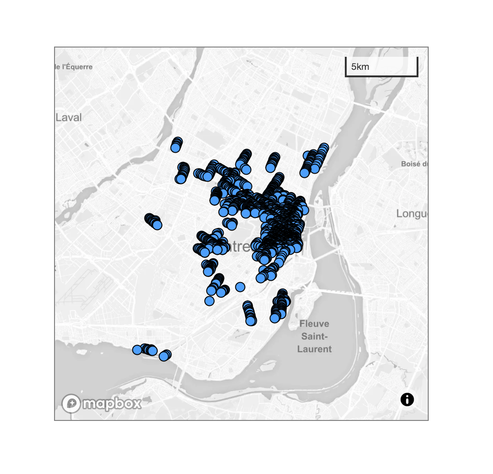

This example below will show you how to start a JMap map in a custom div in your website :



For a live demo, click on this [link](http://jsfiddle.net/K2Geospatial/uaksoLm9/17/).

This example will use one of our demo server, but you need to adapt the restBaseUrl parameter to reach your JMap server.

This example is simple and the user is authenticated as an anonymous user.

Notice :

  - The class "jmap_wrapper" has been added to the body element, it's because all JMap library css code is applyed only inside a div that contains the class "jmap_wrapper", in order to not interfer with your own css code. 
  - The HTML page that contains this code has to be served by a server, it will not works if you copy/paste it in a browser and open the html file locally due to browser security check. 

Bellow the example :

```html
<!DOCTYPE html>
<html>
  <head>
    <meta http-equiv="Content-Type" content="text/html;charset=UTF-8">
    <meta charset="UTF-8">
    <style>
      #my-custom-map {
        margin-left: 50px;
        margin-top: 50px;
        width: 400px;
        height: 400px;
        border: 1px solid grey;
      }
    </style>
  </head>
  <body class="jmap_wrapper">
  	<div id="my-custom-map"></div>
    <script type="text/javascript">
      window.JMAP_API_OPTIONS = {
        projectId: 35,
        restBaseUrl: "https://jmap7dev.jmaponline.net/services/rest/v2.0",
        noSessionExpiration: true,
        anonymous: true,
        map: {
          containerId: "my-custom-map",
          zoom: 9.757829447748511,
          center: {
            x: -73.60243569463414,
            y: 45.504533166207324
          },
          scaleControlVisible: true,
          scaleControlPosition: "top-right"
        }
      }
    </script>
    <script defer type="text/javascript" src="https://cdn.jsdelivr.net/npm/jmap-js-api@0.3.6/public/index.js"></script>
  </body>
</html>
```
